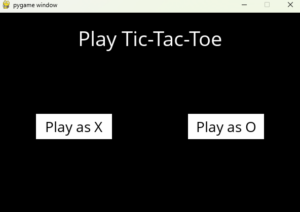
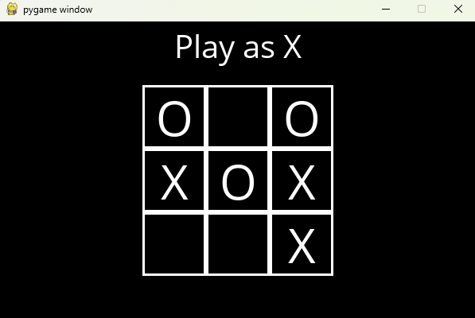
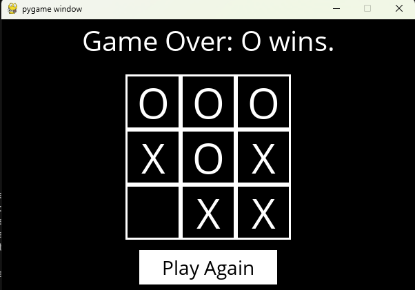

# Tic-Tac-Toe

A continuation of learning from the tic-tac-toe game, following the course provided by HCS50 course

---

## Table of Contents

- [Overview](#overview)  
- [Features](#features)  
- [Screenshots](#screenshots)  
- [Requirements](#requirements)   

---

## Overview

The program is inspired as a continuation of learning from the rock paper scissors program, with the desire to take on a more challenging solution. The adversarial minimax algorithm for detecting the next best move was a very exciting learning opportunity. 

With the course provided by HCS50 I learned how the algorithm works and more about about general good algorithm design. The recursion proved to be the greatest challenge of implementing the minimax algorithm, especially how the array behaved in recursion, being maintained on the heap and that it is working with different reffrences to the same array, not copies of it. 

---

## Features

- Minimax Algorithm  
- Option to select to play as X or O
- GUI display to interact with the game

---

## Screenshots 

| Player selection | Mid game | Win state |
|-------------|-------------|-------------|
|  |  |  |

---

## Requirements 

- Python 3.x    